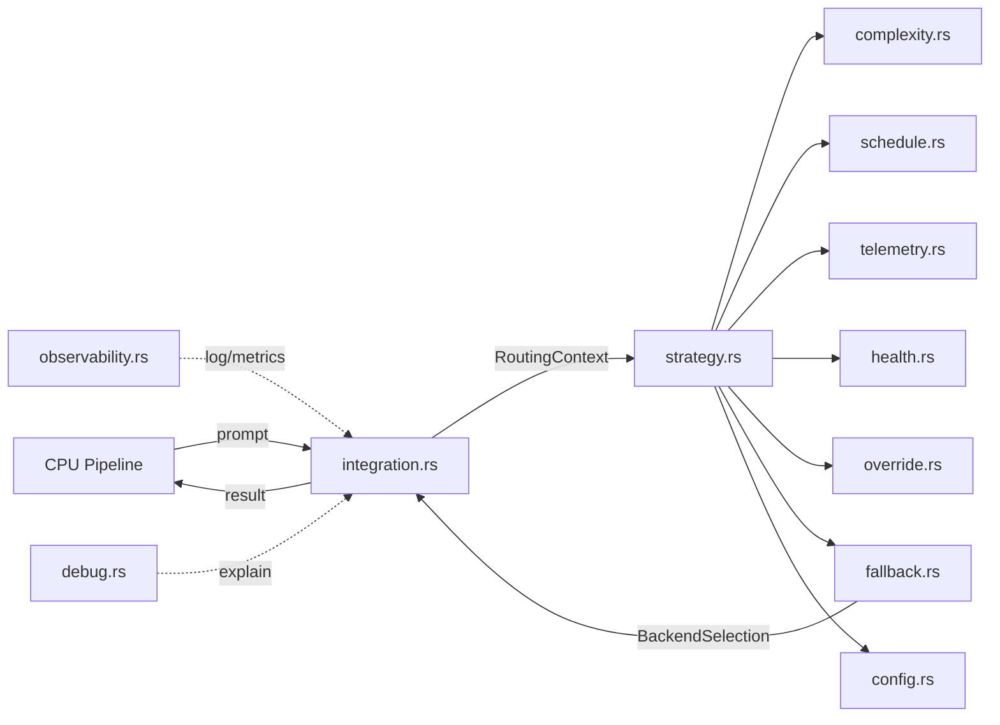

# LLM Router — Data Flow & Decision Flow Diagrams (Task 148.3)

## High-Level Data Flow (ASCII)

```
User Prompt
     │
     ▼
CPU Prompt Preprocessor
     │
     ▼
RoutingContext
  ├─ prompt + token_estimate
  ├─ complexity_score
  ├─ timestamp
  ├─ user_override (optional)
  ├─ telemetry (optional)
  └─ health (optional)
     │
     ▼
decide_backend_with_full_context()
     │
     ├── Complexity Scoring Engine
     ├── Schedule Evaluator
     ├── Telemetry Snapshot
     ├── Health Status Check
     ├── Override Resolution
     └── Fallback Chain
     │
     ▼
BackendSelection
  ├─ chosen backend
  ├─ fallbacks_attempted[]
  ├─ reason
  ├─ health_snapshot
  └─ timestamp
     │
     ▼
LLM Inference
```

## Decision Flow (Mermaid)

```mermaid
flowchart TD
    A[User Prompt] --> B[Build RoutingContext]
    B --> C{User Override?}
    C -->|Yes| D[Return Override Backend]
    C -->|No| E[Calculate Complexity Score]
    E --> F[Evaluate Schedule Profile]
    F --> G[Check Telemetry & Load]
    G --> H[Check Backend Health]
    H --> I[Run Core route() Function]
    I --> J{Primary Healthy?}
    J -->|Yes| K[Return Primary]
    J -->|No| L[Walk Fallback Chain]
    L --> M{Healthy Fallback Found?}
    M -->|Yes| N[Return Fallback]
    M -->|No| O[Return Fallback Backend]
    K --> P[BackendSelection + Audit Trail]
    N --> P
    O --> P
    D --> P
    P --> Q[Log Decision + Update Metrics]
```

## Component Interaction Diagram (Mermaid)



## Routing Decision Tree Example (Simplified)

```
Prompt: "Write a complex Rust async function with error handling"
│
├─ Token estimate: 180 → +0.18
├─ Contains code: true → +0.30
├─ Reasoning keywords: none
├─ Complexity score: 0.72 (above threshold 0.65)
│
├─ Schedule: default profile
├─ Telemetry: GPU 45% (under threshold)
├─ Health: Ollama=healthy, Gemini=healthy
│
├─ Primary choice: Gemini (high complexity)
├─ Health check: Gemini reachable
└─ Final selection: Gemini
   Reason: "high complexity + healthy high-tier backend"
```

These diagrams are also referenced from `LLM_ROUTER_ARCHITECTURE.md`.
