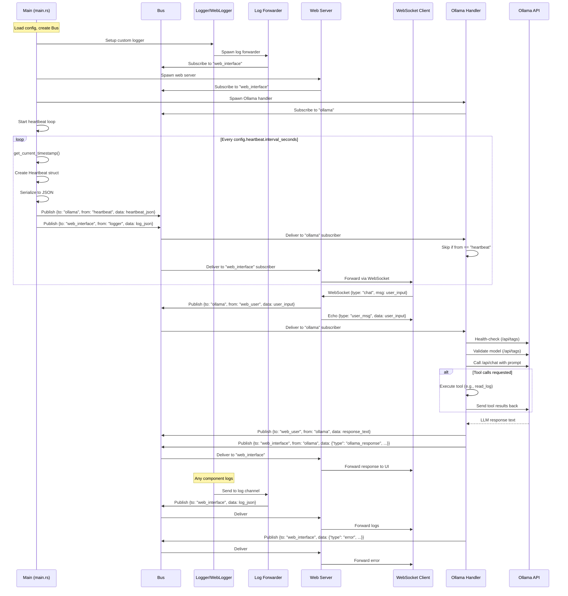

# Data Flow Map for Bot Project

This document visualizes the execution and data flow through the Rust bot application. The system uses a central message bus for inter-component communication.

## Text-Based Sequence Diagram

```
[Startup Phase]
Main (main.rs)
    ├── Load config.toml
    ├── Create Bus instance
    ├── Setup custom Logger (WebLogger) → forwards logs to bus channel
    ├── Spawn Log Forwarder task
    │   └── Subscribes to log channel → Publishes to Bus {to: "web_interface", data: log_json}
    ├── Spawn Web Server task
    │   └── Subscribes to Bus {to: "web_interface"} → Forwards to WebSocket clients
    ├── Spawn Ollama Handler task
    │   └── Subscribes to Bus {to: "ollama"} → Processes messages (skips "heartbeat" from)
    └── Start Heartbeat Loop (infinite)

[Runtime Phase - Heartbeat Loop (every config.heartbeat.interval_seconds)]
Main (main.rs) → Heartbeat (send_heartbeat function)
    ├── Call get_current_timestamp() → Returns u64 (Unix ms)
    ├── Create Heartbeat struct {timestamp, system_status, recent_events}
    ├── Serialize to JSON string
    ├── Publish to Bus: Message {to: "ollama", from: "heartbeat", data: heartbeat_json}
    ├── Publish to Bus: Message {to: "web_interface", from: "logger", data: log_json ("Heartbeat sent")}
    └── Ollama Handler receives but skips (if from == "heartbeat") → No further action

[Runtime Phase - User Chat via Web UI]
Web Server (io/web_server/mod.rs) ← WebSocket Client (e.g., browser)
    ├── Receive WebSocket message {type: "chat", msg: user_input}
    ├── Publish to Bus: Message {to: "ollama", from: "web_user", data: user_input}
    ├── Echo to WebSocket: {type: "user_msg", from: "You", data: user_input} (via broadcast channel)
    └── Ollama Handler receives {to: "ollama"} → Process

[Runtime Phase - Ollama Processing (handle_ollama_message in io/ollama/mod.rs)]
Ollama Handler ← Bus {to: "ollama", from: e.g., "web_user"}
    ├── Health-check Ollama API (/api/tags)
    ├── Validate model exists (fetch /api/tags)
    ├── Call Ollama API (/api/chat) with prompt
    │   ├── (Optional: Tool calls loop if LLM requests tools, e.g., read_log/send_email → execute locally → send results back)
    ├── On success: Get LLM response text
    ├── Publish to Bus: Message {to: original_sender (e.g., "web_user"), from: "ollama", data: response_text}
    ├── Publish to Bus: Message {to: "web_interface", from: "ollama", data: {"type": "ollama_response", "msg": response_text}}
    └── Web Server receives {to: "web_interface"} → Forwards to WebSocket clients → Display in UI

[Runtime Phase - Logging (anywhere in code)]
Any Component (e.g., Main, Heartbeat, Ollama) → Logger (WebLogger)
    ├── Log via log crate (e.g., info!("message"))
    ├── WebLogger sends to log channel
    └── Log Forwarder receives → Publish to Bus {to: "web_interface", data: log_json}

[Runtime Phase - Errors/Warnings]
Ollama Handler (on failure)
    ├── Publish to Bus: Message {to: "web_interface", from: "ollama", data: {"type": "error"/"warning", "msg": error_text}}
    └── Web Server receives → Forwards to WebSocket clients → Display in UI

[Shutdown/Edge Cases]
- Bus logs all transactions to logs/chat_log.md
- Web Server handles config saves → Publishes status back to Bus {to: "web_interface"}
- If heartbeat fails repeatedly (5+ times), logs warning but continues
- Ollama retries on failure (up to 3 times with delay)
```

## Graphical Diagram (Mermaid Sequence Diagram)



### Key Notes
- **Bus**: Central hub for all messages. Components subscribe to topics (e.g., "ollama", "web_interface").
- **Heartbeat**: Generates timestamp, sends to bus (ignored by Ollama), logs to web UI.
- **Ollama Flow**: Processes requests, handles retries/tools, replies to sender and web UI.
- **Web Interface**: Bridges bus to real-time WebSocket updates.
- View this in a Markdown viewer with Mermaid support (e.g., GitHub, VS Code) for graphical rendering.