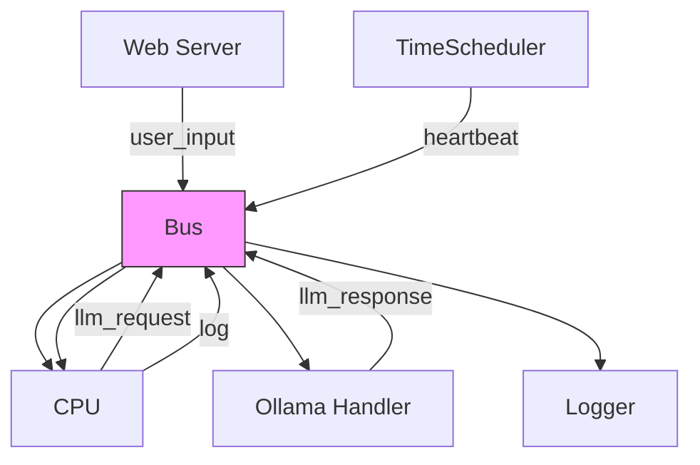
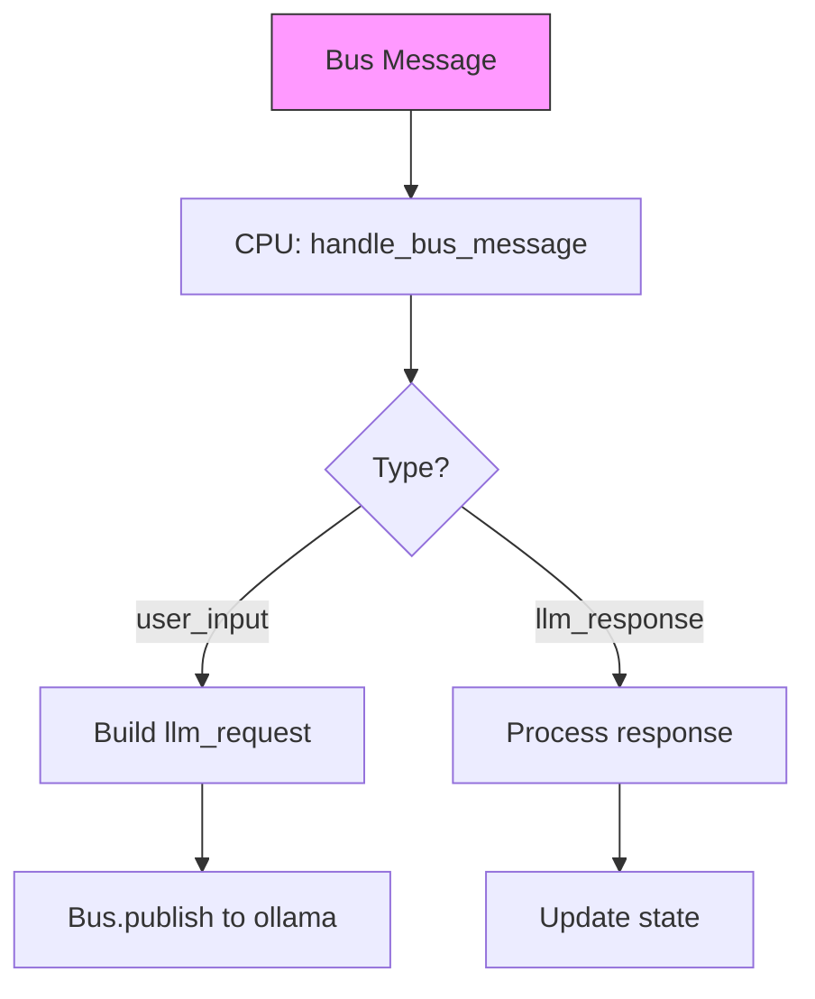
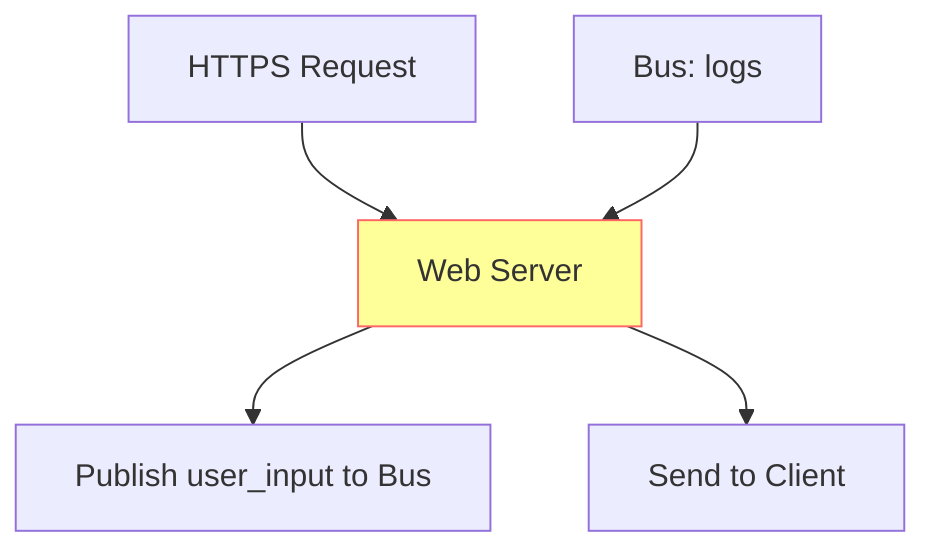
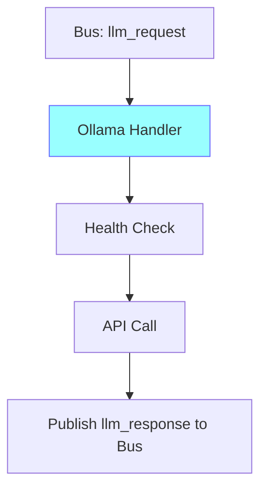
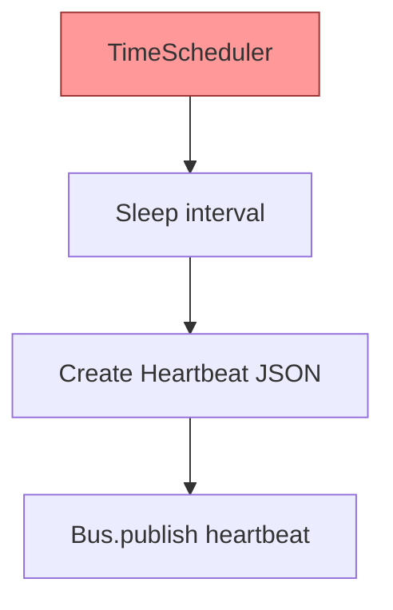

# Flow Map

This document describes the key data and control flows in the bot project. It includes text descriptions and Mermaid diagrams for visualization. Flows cover execution, memory, skills/hooks, HyEvo evolutionary layer, web interface, heartbeat, LLM integration, and bus messaging.

## Overall System Flow
1. **Initialization**: `main.rs` creates `Bus`, subsystems (MemoryManager with working/episodic/vector memories, Skills, Hooks, HyEvo), spawns web server, Ollama handler, CPU, and TimeScheduler for heartbeat.
2. **Event Loop**: Bus handles pub-sub messaging between components (cpu, ollama, web_interface, heartbeat, logger).
3. **CPU Processing**: CPU receives bus messages, handles user input by forwarding to Ollama, processes responses.
4. **Heartbeat**: TimeScheduler sends periodic heartbeat messages via bus.
5. **Web Interface**: Web server receives user input, publishes to bus as user_input messages.
6. **Ollama Integration**: Handles LLM requests asynchronously, publishes responses back to bus.
7. **HyEvo Feedback Loop**: Collects metrics from executions, evolves workflows for adaptation.
8. **Output**: Responses sent to web interface or logged.

## Bus Messaging Flow
Text Flow:
- Components subscribe to topics (e.g., "cpu", "ollama").
- Messages are JSON with type, data, timestamp.
- CPU publishes LLM requests to "ollama".
- Ollama publishes responses to "cpu".
- Web server publishes user_input to "cpu".
- Logger receives logs from all.

Mermaid Diagram:


## Core CPU Execution Flow
Text Flow:
- Receive bus message (e.g., user_input).
- Parse JSON payload.
- For user_input: build LLM request, publish to bus.
- For llm_response: process and update state.
- Bump tick in AgentState.

Mermaid Diagram:


## Web Server Flow
Text Flow:
- Start HTTPS server on configured port.
- Handle incoming requests (e.g., chat input).
- Publish user_input message to bus.
- Receive logs from bus and forward to clients.

Mermaid Diagram:


## Ollama LLM Flow
Text Flow:
- Subscribe to "ollama" topic.
- Receive llm_request messages.
- Call Ollama API asynchronously (with health checks, retries).
- Publish llm_response back to bus.

Mermaid Diagram:


## Heartbeat Flow
Text Flow:
- TimeScheduler runs in a loop, sleeping for interval.
- Publishes heartbeat message to bus with timestamp, status, recent events.
- CPU or other components can react to heartbeats.

Mermaid Diagram:


## Memory Management Flow
Text Flow:
- MemoryManager combines Working (short-term VecDeque), Episodic (event records), Vector (fact search).
- Async reads/writes via `MemoryInterface` on working memory.
- Context joining: `VecDeque<String>.iter().join(" ")` for concatenated beliefs.
- Episodic records user messages and events.
- Vector searches facts with similarity.
- Beliefs updated post-execution (e.g., after skill run).

## Skills and Hooks Flow
- **Skills**: Registry lookup by name; execute async Fn with params (HashMap serialized to Value).
- **Hooks**: Phase-based (e.g., init); sequential execution on mutable state.

## HyEvo Evolutionary Flow
**Purpose**: Evolves workflows using LLMs for reflection. Integrates with CPU for dynamic adaptation.

Text Flow:
1. **Seeding**: Initialize `HyEvoEngine` with initial genome (workflow JSON/tree).
2. **Execution**: CPU retrieves `best_workflow()` as Nodes; executes via `execute_workflow`.
3. **Evaluation**: Collect metrics (e.g., success rate, latency) from executions.
4. **Evolution**: Call `evolve_once(metrics)`; uses `ReflectionLlm` to generate feedback and suggestions.
5. **Integration Loop**: Lock `HyEvoIntegration` mutex; update on each cycle.
6. **Modules**: Includes genome representation, mutation, crossover, scoring for future enhancements.

Mermaid Diagram (HyEvo Integration):
```mermaid
graph LR
    A[main.rs: Init HyEvoIntegration<L: ReflectionLlm>] --> B[Seed: engine.seed(initial_genome)]
    B --> C[CPU: Get best_workflow() via integration.lock()]
    C --> D[Execute Workflow: Match Node -> execute_skill/llm/code]
    D --> E[Skills/Hooks/Memory: Run Node Actions]
    E --> F[Collect Metrics: e.g., success, time]
    F --> G[Evolve: engine.evolve_once(metrics).await]
    G --> H[LLM Reflection: Prompt for feedback/suggestions]
    H --> I[Record Reflection: Update population]
    I --> C
    style G fill:#ff9,stroke:#f66
```

**HyEvo Node Execution Sub-Flow**:
- Skill Node: `params: HashMap -> to_value()` -> `execute_skill(name, &Value)`.
- LLM Node: Similar, with model/prompt.
- Code Node: Executes custom code with params.
- Error Handling: `NodeResult` propagates up.

## Error Handling Flow
- All async ops use `?` propagation.
- Serde serialization for events/params.
- Logs sent to bus for forwarding.

## Additional Components
- **commands/**: TypeScript command handlers for bot interactions.
- **config/** & **events/**: Supporting modules for configuration and event-driven architecture.
- **A2A, Cron, MCP, Hartbeat**: Fully integrated into the bus and CPU execution flows for multi-agent, scheduling, protocol, and monitoring capabilities.
- **Multi-Agent**: Bus for inter-agent communication via A2A.
- **Cron Jobs**: Scheduled tasks via cron handler.
- **MCP**: Model control protocol integration.
- **Metrics to External**: Feed to dashboard.
- **Visualization**: Generate DOT files from workflows.
- **Enhanced HyEvo**: Implement mutation, crossover, scoring for full evolution.
